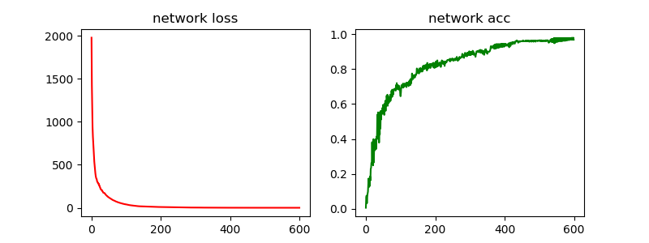
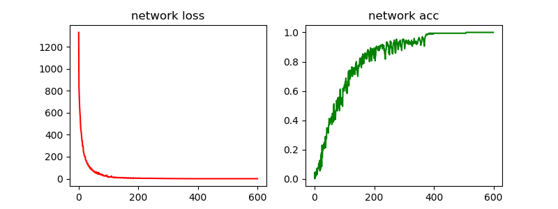
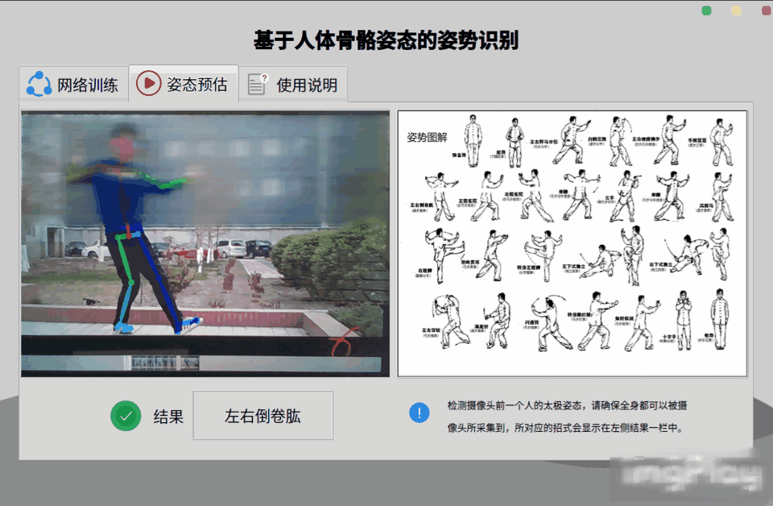

# 0. 创新点

    
 :octocat: 两个手工定制的特征，实现快速识别  
 :octocat: 第一个是距离，两个关键点的距离会随着动作不同而不同。    
 :octocat: 第二个是角度，考虑到距离会随着摄像头位置发生变化，而三个点的夹角不同，不论远近，夹角固定，同时夹角会随着动作不同而不同。  

# 1. Overview 

- 
- 基于普通摄像头的太极姿势识别(分类)，通过openpose采集的骨骼点数据做分类。
  - 第一就是通过openpose采集的骨骼数据做一个自定义特征的全连接网络的训练分类。（已完成）
  - 第二就是通过openpose采集的骨骼图片做卷积神经网络（CNN）分类（已完成）
- 相关：[基于Kinect的姿态识别(分类)](https://github.com/wfnian/kinect/wiki)

## 1.1. 安装与使用

首先根据OpenPose WindowsAPI安装说明安装，调用方式为Python调用。  
[OpenPose GitHub地址](https://github.com/CMU-Perceptual-Computing-Lab/openpose)  
<u>[OpenPose安装说明](https://github.com/CMU-Perceptual-Computing-Lab/openpose/blob/master/doc/installation.md)</u>
最近迁移至Ubuntu，Windows的更新后cuda与caffee不兼容。部分程序有改动。总体不变。
- 若有需要和问题可提issues.我在Windows，Ubuntu，Mac上均安装过OpenPose。

### 1.1.1. 程序开发目录说明

> `git clone` 下来后`cmake`进行编译,其中要勾选`BUILD_PYTHON`进行编译才能被python调用。

workspace 程序开发目录详细说明

- 📂workspace
  - 📁data_collection(数据采集)
    - data_collection_window.py
    - data_collection_window.ui
    - data_collection.py
  - 📁dataset (数据集)
    - 📁taichi
      - 📁marked_pic
        - 🎴 p_2_0.jpg（最后一个下划线后面是类别，此处`0`是类别，前一个数字`2`代表大概数量）
        - 🎴 ...
      - 📄bone_dataSet.data(骨骼特征数据)
      - 📄marked_pictrain.txt(图片路径)
  - 📁main_program
    - main.py 主程序入口
    - mainWindow.py
    - mainWindow.ui
  - 📁model_pth (模型保存位置)
    - 23classification_eigenvalue.pth
    - 23classification_pic.pth
  - 📁neural_network
    - 📁runs (tensorboard 可视化,如果有必要)
    - 📃classification23_taichi_eigenvalue.py
    - 📃classification23_taichi_pic.py
    - 📃data_process.py
    - 📃predict_eigenvalue.py
    - 📃predict_pic.py
  - 📁openpose_python_demos (包含一些python使用openpose的例子)
    - 📃flags.hpp(调用openpose的参数设置)
    - 📃use_camera_by_opencv.py
    - 📃use_camera.py
  - 📁sundry (包含一些界面设计的图片等杂项)
    - ...

## 1.2. 训练效果

| 全连接 | 卷积网络 |
| :-: | :-: |
|     |        |

## 1.3. 展示效果

| 数据采集系统 | 识别系统 |
| :-: | :-: |
|     | |
> 说明：由于在Ubuntu下选择了桌面是unity所以不能录屏，展示为GIF图片。  
> 由于电脑的摄像头在下方，使用iPad来作为输入。效果依旧是实时效果，但是数据量较小。

## 1.4. 关于更更更更具体的思路

> 点击查看[论文简版](https://github.com/wfnian/posture_recognition/blob/master/workspace/%E8%AE%BA%E6%96%87%E7%AE%80%E7%89%88.pdf)   
> 或者[这个地址：腾讯文档](https://docs.qq.com/pdf/DWlNNR0xtZGdsRnpQ)  
> 啊我的论文纯属凑字数的，写的乱，别笑我 :octocat: :octocat:  

## 1.5. 答辩结果

> 校级答辩 `优秀` 哈哈哈哈哈，承蒙老师指导，承蒙答辩老师欣赏，承蒙被抽到校级答辩。

# 写在最后

这个属于特别简单的一个本科生的毕业设计，思路可以模仿而内容不可照搬。

**禁止商用**
