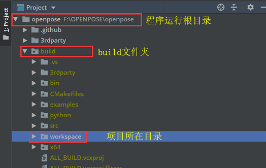

# Overview 

- 
- Posture recognition based on common camera 基于普通摄像头的太极姿势识别(分类)
- 相关：[基于Kinect的姿态识别(分类)](https://github.com/wfnian/kinect/wiki)
- 若有需要和问题可提issues.

## 安装与使用
首先根据OpenPose WindowsAPI安装说明安装，调用方式为Python调用。  
[OpenPose GitHub地址](https://github.com/CMU-Perceptual-Computing-Lab/openpose)  
[Windows OpenPose安装说明](https://github.com/CMU-Perceptual-Computing-Lab/openpose/blob/master/doc/installation.md)

### 程序开发目录说明
> `git clone` 下来后`cmake`进行编译,其中要勾选`BUILD_PYTHON`进行编译才能被python调用。
> 

workspace 程序开发目录详细说明

- workspace
  - data_collection📁(数据采集)
  - dataset📁 (数据集)
    - taichi📁
      - marked_pic📁
        - p_2_0.jpg（最后一个下划线后面是类别，此处`0`是类别，前一个数字`2`代表大概数量）
        - ...
      - marked_pictrain.txt📄
  - model_pth📁 (模型保存位置)
  - neural_network📁 
    - runs📁 (tensorboard 可视化,如果有必要)
    - classification23_taichi_eigenvalue.py📃
    - classification23_taichi_pic.py📃
    - data_process.py📃
    - predict_eigenvalue.py📃
    - predict_pic.py📃
  - openpose_python_demos📁 (包含一些python使用openpose的例子)
  - flags.hpp📃(调用openpose的参数设置)
  - use_camera_by_opencv.py📃
  - use_camera.py📃
  - sundry📁 (包含一些界面设计的图片等杂项)
    - ...

